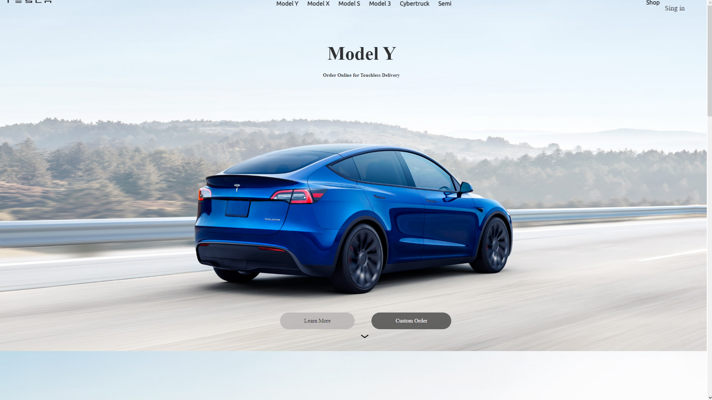

# Clone - Tesla Cars
Um Projeto Desenvolvido Com O Intuito De Praticar O Uso De HTML E CSS, Para Isso Foi Feito Um Clone Do Site Da [Tesla](https://www.tesla.com/).

Na Imagem Acima, Podemos Ver Modelos De Carros Da Empresa Tesla. É Possível Navegar Entre Esses Modelos Usando A Seta Presente Na Imagem, Assim Como A Barra De Navegação. Além Disso, É Possível Acessar As Páginas Dos Modelos Cybertruck E Semitruck, Que Fornecem Mais Detalhes Sobre Esses Modelos.

